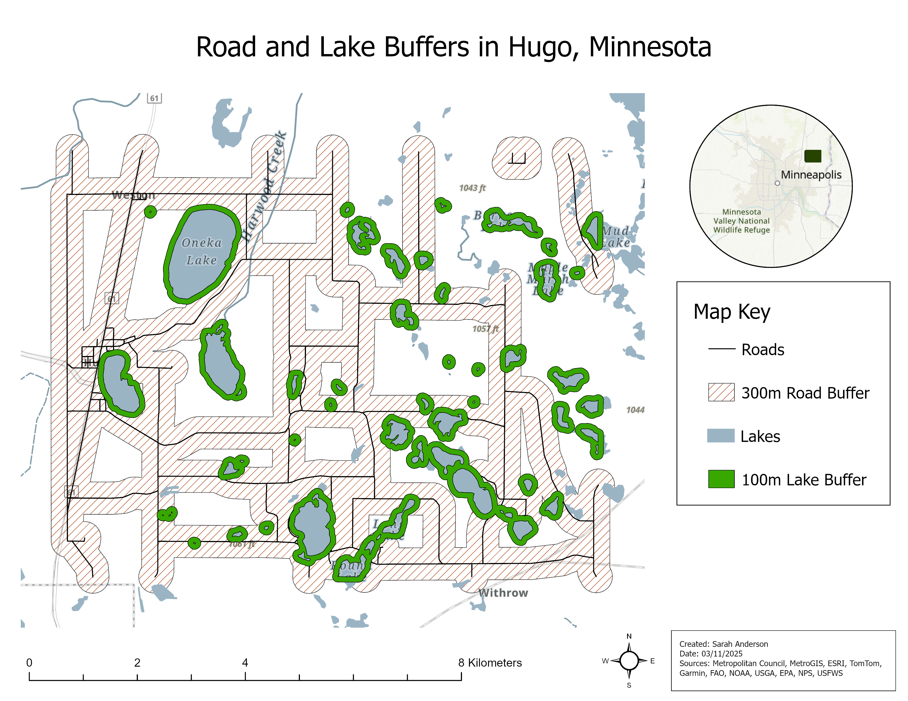
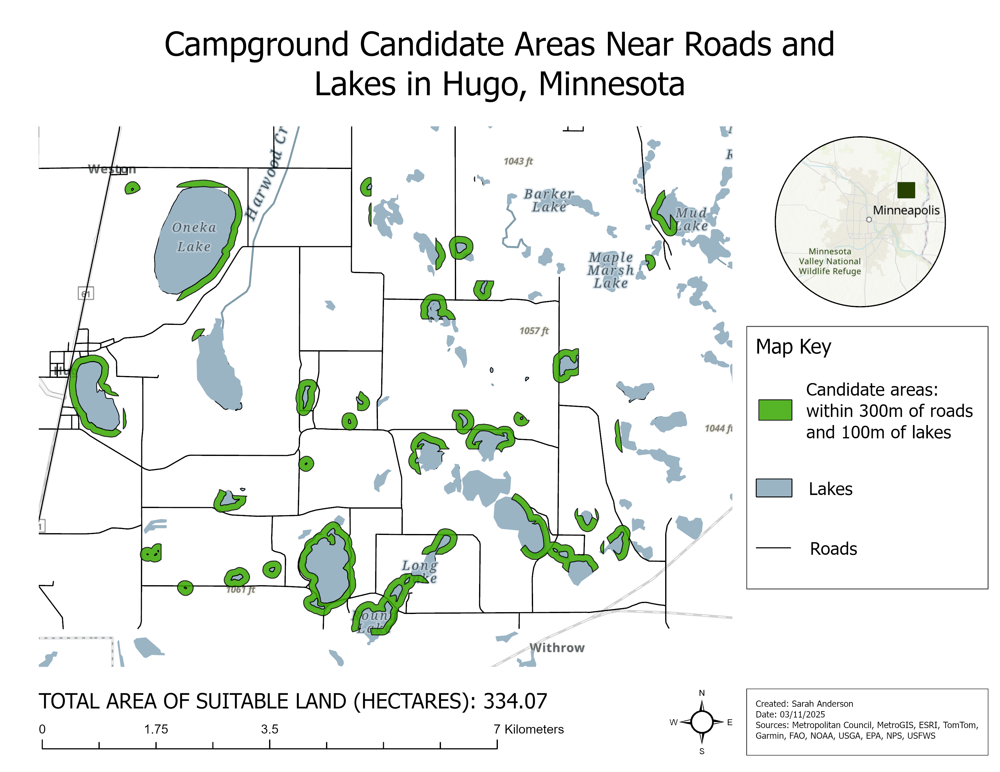
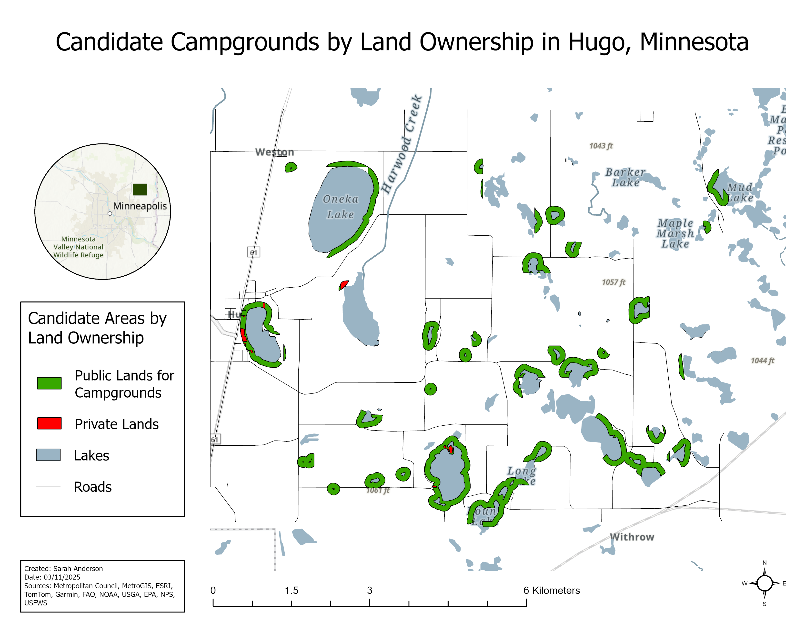

# Hugo Campground Site Screening

An ArcGIS Pro screening workflow for identifying areas near roads and lakes that may warrant further campground-site review near Hugo, Minnesota.

## Methods

- Created 300 m road buffers and 100 m lake buffers; dissolved overlapping road buffers for a clearer analysis zone.
- Overlaid the buffers to identify areas within both distance thresholds.
- Converted multipart results to singlepart features and calculated area. The combined proximity candidates total 334.07 hectares before ownership filtering.
- Used a private-land layer to separate public-land candidates from candidate areas overlapping private land.

## Outputs

- `images/road-and-lake-buffers.png` — proximity zones.
- `images/road-and-lake-candidates.png` — areas meeting both proximity criteria.
- `images/candidates-by-ownership.png` — candidate areas categorized by mapped ownership.

## Visualizations

The screening sequence below shows the buffer inputs, the combined road-and-lake candidates, and the ownership context used for preliminary review.

*Road and lake proximity buffers.*

*Areas meeting both proximity criteria.*

*Candidate areas categorized by mapped ownership.*

## Limitations

This is a preliminary map-screening exercise, not a suitability determination. It does not verify legal or practical access, ownership, zoning, terrain, flood exposure, environmental constraints, utilities, permissions, or usable campground area. Mapped proximity and ownership should be validated against current authoritative records before decisions are made. The public-land area was not recalculated in the source work.

## Attribution

Software: ArcGIS Pro. Original map credits: Metropolitan Council, MetroGIS, Esri, TomTom, Garmin, FAO, NOAA, USGS, EPA, NPS, and USFWS. **Attribution placeholder:** confirm the exact dataset names, licenses, and current credit language before publication.

Originally completed as GIS coursework; revised for portfolio presentation.
